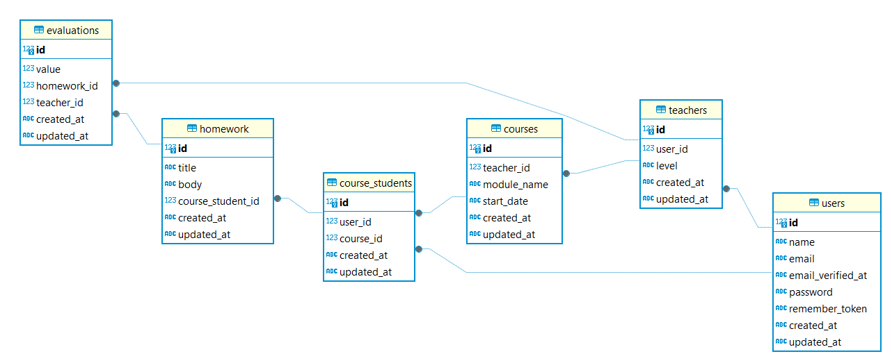

# Homework system

It's a website where you log in as a teacher or as a student.
You can subscribe to a course, into your courses you can submit your homework, you can't edit it.
you can check the homeworks you've already submitted and see the califications teachers gave you.
if you log in as a teacher you willbe able see the curses you are giving and receiving, you can create new 
courses and delete them, you can only delete them before a student subscribes to it. You can also see the 
students enrolled to your course and remove them from it. Also you can see the homeworks they've uploaded
and evaluate them.

## How database looks like



# For running locally this project:

-   ## Install Herd (If not installed already)

    [Download link for Herd :D](https://herd.laravel.com/download/)

-   ## Install git (If not installed already)

    [Download link for Git :D](https://git-scm.com/install/)

-   ## Clone the project

    ```git
      git clone https://github.com/jhuliangr/laravel_homework_system
    ```

-   ## Register the project in Herd

-   ## Install Laravel's dependencies

    ```terminal
      composer install
    ```

-   ## Install Node's dependencies

    ```terminal
      npm install
    ```

-   ## Create a .env for your dev environment

    ```terminal
    cp .env.example .env
    ```

    ### adjust the settings (local domain, database, etc) if needed

-   ## Set the encryption key in the .env

    ```terminal
      php artisan key:generate
    ```

-   ## For using sqlite

    ```terminall
      touch database/database.sqlite
    ```

-   ## For creating the database and populate it
    ```terminal
      php artisan migrate:fresh --seed
    ```
-   ## You're ready to go!! :D

